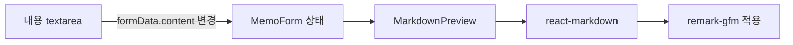

# 메모 편집 Markdown 뷰어 추가 계획

## 라이브러리 선택

- `react-markdown`: React 컴포넌트로 Markdown 문자열을 안전하게 렌더링하는 공식 생태계 라이브러리. Context7 문서 기준 기본 사용은 `import Markdown from 'react-markdown'` 후 `<Markdown>{markdown}</Markdown>` 형태다.
- `remark-gfm`: GitHub Flavored Markdown 확장 지원용. Context7 문서 기준 표, autolink, footnote, 취소선, task list를 지원한다.
- 사용하지 않을 것: `rehype-raw`. Context7 문서에서 raw HTML 렌더링은 신뢰된 환경에서만 주의해서 쓰라고 안내하므로, LocalStorage 기반 사용자 입력 메모에는 raw HTML을 렌더링하지 않는 방향이 안전하다.

설치 예정:

```bash
npm install react-markdown remark-gfm
```

## 변경 대상

- `[package.json](package.json)`: `react-markdown`, `remark-gfm` 의존성 추가
- `[src/components/MarkdownPreview.tsx](src/components/MarkdownPreview.tsx)`: Markdown 미리보기 전용 컴포넌트 신규 추가
- `[src/components/MemoForm.tsx](src/components/MemoForm.tsx)`: 내용 입력 영역을 좌측 편집기 + 우측 미리보기 패널로 변경

현재 `MemoForm`은 내용 입력 textarea만 가지고 있다:

```tsx
<textarea
  ref={contentRef}
  id="content"
  value={formData.content}
  onChange={e =>
    setFormData(prev => ({
      ...prev,
      content: e.target.value,
    }))
  }
/>
```

## 구현 방향




### 1. `MarkdownPreview.tsx` 신규 컴포넌트

- Props: `content: string`
- 빈 내용이면 안내 문구 표시: `Markdown 미리보기가 여기에 표시됩니다.`
- `ReactMarkdown`에 `remarkPlugins={[remarkGfm]}` 적용
- `components` 옵션으로 기본 태그 스타일 지정:
  - `h1`, `h2`, `h3`: 제목 크기/여백
  - `p`, `ul`, `ol`, `li`: 읽기 좋은 간격
  - `a`: 파란 링크 + `target="_blank"` + `rel="noopener noreferrer"`
  - `code`, `pre`: 회색 배경 코드 스타일
  - `table`, `th`, `td`: 테이블 테두리/스크롤 대응
  - `input`: task list checkbox disabled 스타일 유지

예상 형태:

```tsx
'use client'

import ReactMarkdown from 'react-markdown'
import remarkGfm from 'remark-gfm'

interface MarkdownPreviewProps {
  content: string
}

export default function MarkdownPreview({ content }: MarkdownPreviewProps) {
  if (!content.trim()) {
    return <p className="text-sm text-gray-400">Markdown 미리보기가 여기에 표시됩니다.</p>
  }

  return <ReactMarkdown remarkPlugins={[remarkGfm]}>{content}</ReactMarkdown>
}
```

### 2. `MemoForm.tsx` 좌우 분할 UI

- `MarkdownPreview` import 추가
- 모달 폭을 `max-w-2xl`에서 `max-w-5xl` 정도로 확대
- 내용 섹션을 `grid grid-cols-1 lg:grid-cols-2 gap-4`로 구성
- 좌측: 기존 textarea 유지, `rows`를 조금 늘려 편집 공간 확보
- 우측: `MarkdownPreview` 패널 추가, `min-h`와 `overflow-y-auto`로 긴 메모 대응
- 모바일/태블릿에서는 위아래로 쌓이고, 넓은 화면에서 좌우 분할

### 3. UX 세부 사항

- 기존 저장/수정/삭제/ESC 닫기 동작은 유지
- 모달 오픈 시 내용 textarea로 포커스되는 기존 동작 유지
- 미리보기는 입력과 동시에 실시간 갱신
- Markdown 원문은 그대로 `content`에 저장하므로 LocalStorage 구조와 타입 변경 없음

### 4. 검증

- `npm run lint`
- 가능하면 `npm run build`
- 브라우저에서 아래 케이스 수동 확인:
  - `# 제목`, `**굵게**`, `- 목록`
  - 표 Markdown
  - `- [x] 체크리스트`
  - 링크 클릭 시 새 탭 열림
  - ESC 닫기, 수정 저장, 모달 삭제 버튼 기존 동작 유지

